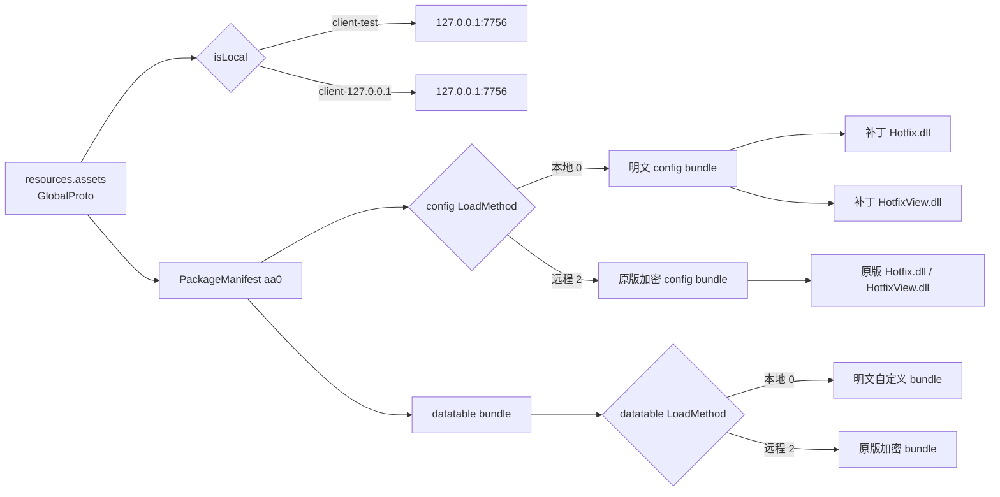
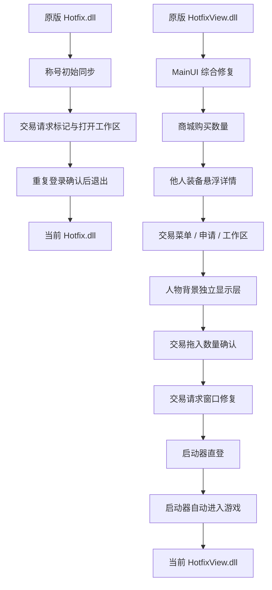
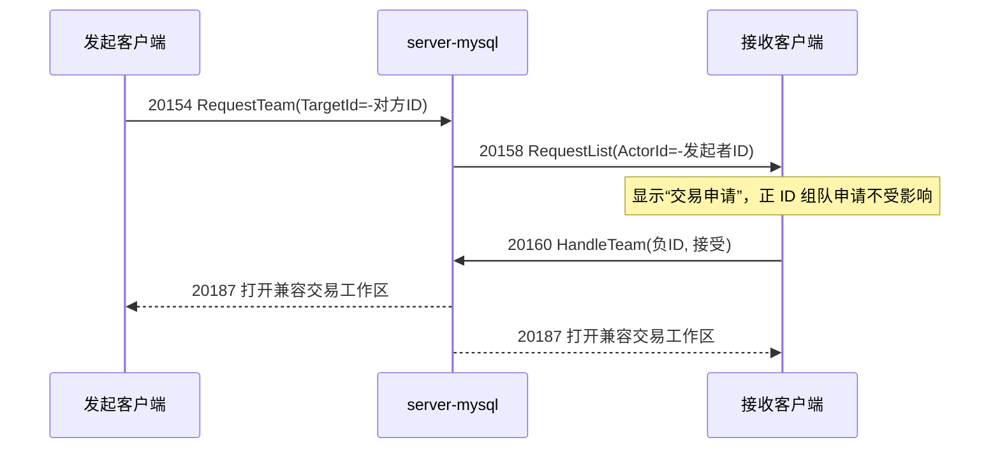

# 客户端补丁清单与回滚图

> 核验时间：2026-09-03。
> 本文只记录客户端文件补丁。服务端协议兼容、数据库和运营配置不属于客户端补丁。
> 当前结论：功能 DLL 补丁只安装在 `client-test/`；远程客户端仍使用原版 DLL，只修改服务器地址。

> **2026-09-03 目录与叠加规则（优先于本文早期哈希/备份描述）**：补丁产物、当前 DLL
> 副本和回滚备份统一放在 `server-mysql/client-patches/client-test/`。本地客户端的
> `StreamingAssets/yoo/_extracted` 是指向该目录 `current/` 的分析 junction；真正运行时
> 读取的仍是 `aa0/5ff0cd3f4dadb1ed406add45f5bbb636.bundle`。不要再使用根目录
> `_archive/client-test-backups` 作为安装输入，也不要把远程客户端的 DLL、bundle 或
> `resources.assets` 覆盖到本地。
>
> 根目录旧快照已迁入 `server-mysql/client-patches/client-test/backups/legacy-20260830/`，仅作审计和问题追溯，
> 不参与任何自动重建。

## 1. 当前加载链路



`_extracted/Hotfix*.dll` 是分析和打补丁输入；客户端运行时真正读取的是
`aa0/5ff0cd3f4dadb1ed406add45f5bbb636.bundle` 内的两个 `TextAsset`。在当前目录规范下，
`_extracted` 是指向 `server-mysql/client-patches/client-test/current/` 的 junction。**当前集中管理的安装器**
必须同时更新 `current/`、运行 `aa0` bundle 和存在时的 `_dec/aa0`，不能只替换任一份 DLL；仍标为
`legacy` 的早期脚本不要在当前链上重复执行。

## 2. 当前精确状态

| 项目 | `client-test` | `client-127.0.0.1` |
|---|---|---|
| 实际地址 | `LocalAddress=127.0.0.1:7756` | `Address/LocalAddress=127.0.0.1:7756` |
| `isLocal` | `true` | `true` |
| config `LoadMethod` | `0`，加载明文补丁 bundle | `2`，加载原版加密 bundle |
| datatable `LoadMethod` | `0`，本地明文自定义 bundle | `2`，远程原版加密 bundle |
| `Hotfix.dll` | `08E774A4A8D2E667C4D1309DC6DF80C3DFDC083026C835DD0C9EE9794A629497` | `24B3B6ABB5189A178A5389FF05407E04A8578185AB67B5438D11408E3FBDE4F5`（原版） |
| `HotfixView.dll` | `DFAD86065C4963F63853AF112F8029E2728EDE4A6021CB93E5B0E7942DC32D15` | `7D9256FF...2FC889`（原版） |
| 功能 DLL 补丁 | 已安装下表本地功能 | 未安装 |
| 地址补丁 | 本地地址基线 | 已安装远程 IP 补丁 |

> ## ⚠ 阅读本文哈希与备份路径前必读（2026-09-14 复核）
>
> 本文件里**逐条列出的快照哈希、bundle 文件名和 `.bak` 备份路径是“当时那次审计”的取值，会随补丁层叠加而失效**。
> 已确认的具体错误与更正：
>
> - `Hotfix.dll` 本地当前哈希应为 **`08E774A4…629497`**（原文多处写 `3CEE7220…`，已更正）。
> - 远程两个 DLL 应为 **`24B3B6AB…FBDE4F5`** / **`7D9256FF…2FC889`**（原文 §2 下方写的 `85F1F34A…`/`7D92D7C0…`
>   在仓库中无对应文件，已更正）。
> - `633b7e230e7bc8ab82120977c63a1efa`（Bag bundle）**仓库中不存在**，不可引用。
> - `f786a0cc…bundle.pre-custom-skins.bak` **不存在**；该 bundle 本体只在远程客户端和
>   `_archive/client-test-backup-20260824/`。
> - `ecd55fb0…bundle` **不在 `client-test/`**，只在 `_work/byakuya-skin25-bundles/encrypted/`。
> - **备份路径**：`pre-launcher-*`、`pre-byakuya-*`、`pre-bankai-*` 这些层级备份位于
>   `server-mysql/client-patches/client-test/backups/legacy-20260830/梦幻奇遇记_Data/StreamingAssets/yoo/{aa0,_extracted}/`；
>   `backups/_extracted/` 与 `backups/aa0/` 下**只有** 6 个 DLL + 6 个 bundle 快照。
>   另外 `client-test` **没有 `_dec/` 目录**（`_dec` 只在远程客户端和归档快照里）。
> - 本节标题与 §3/§5 中标注「2026-09-03 规则优先」的结论仍然有效；**只有哈希和文件路径需要重新取值**。
>
> 取当前实际值的唯一可靠方式（只读，不写客户端）：
>
> ```powershell
> python server-mysql/client-patches/client-test/audit_patch_state.py
> Get-Content server-mysql/client-patches/client-test/SHA256SUMS.txt
> ```

远程两个 DLL 的完整 SHA256（**2026-09-14 复核更正**：原文列的两个哈希
`85F1F34A…` / `7D92D7C0…` **在仓库里找不到任何对应文件**，与本节表格第 52 行自相矛盾，已按实际文件更正）：

- `Hotfix.dll`：`24B3B6ABB5189A178A5389FF05407E04A8578185AB67B5438D11408E3FBDE4F5`
- `HotfixView.dll`：`7D9256FFF2746310227E0509EB340198842C78CEC7D857E9C482A201E52FC889`

（复核命令：`sha256sum client-127.0.0.1/梦幻奇遇记_Data/StreamingAssets/yoo/_extracted/{Hotfix,HotfixView}.dll`）

## 3. 本地功能补丁叠加图



| 序号 | 补丁 | 修改文件 | 作用 | 当前状态 |
|---|---|---|---|---|
| 1 | MainUI 综合修复 | `HotfixView.dll` | 主界面入口、左右键、普通攻击弹道调用签名、背包丢弃、熔炼刷新 | 仅本地启用 |
| 2 | 称号初始同步 | `Hotfix.dll` | 把他人 `UnitCharacter.Title` 初始化到 `NumericType 1038` | 仅本地启用 |
| 3 | 商城购买数量 | `HotfixView.dll` | 普通商店和商城都弹数量输入；元宝/代金券按页签购买；确认后真实发送 | 仅本地启用 |
| 4 | 他人装备悬浮详情 | `HotfixView.dll` | 查询装备时使用被查看角色窗口的 `CharacterUI.id` | 仅本地启用 |
| 5 | 交易兼容 | 两个 DLL | 独立交易申请、保留组队申请、接受后打开兼容交易工作区 | 仅本地启用 |
| 6 | 重复登录确认 | `Hotfix.dll` | 收到原生 `20328` 后显示提示，点确定才退出旧客户端 | 仅本地启用 |
| 7 | 服务器地址 | `resources.assets` | 固定本地或远程 TCP 地址，不改变资源文件大小 | 两个客户端各自启用 |
| 8 | 大黄蜂 Skin25 | aa1 Manifest + 3 个独立 Bundle + `Unity.ModelView.dll` | v13 八姿势待机、汽车尾喷和战斗重炮 | 仅本地启用 |
| 9 | 人物背景显示 | `HotfixView.dll` + `CharacterBackgrounds/*.png` | 读取穿戴槽 1，在原动画背景上方插入对应静态背景层，打开/穿戴/切换/脱下均刷新 | 仅本地启用 |
| 10 | 交易拖入数量确认 | `HotfixView.dll` | 交易模式下每次从背包拖入都弹数量框；仓库保持原行为 | 仅本地启用 |
| 11 | 朽木白哉完整动画 | aa1 Manifest + 2 个独立 Bundle + `Unity.ModelView.dll` | 稳定待机施法、灵压剑与循环瞬步 | 仅本地启用 |
| 12 | 卍解一护完整动画 | aa1 Manifest + 2 个独立 Bundle + `Unity.ModelView.dll` | 双刀卐字灵压、武器落地、御剑飞行、灵压斩和普通受击 | 仅本地启用 |
| 13 | 启动器直登 | `HotfixView.dll` | 直接填写 FairyGUI 登录输入框并调用原有登录回调，不依赖延时、焦点和模拟输入 | 仅本地启用 |
| 14 | 启动器自动进入游戏 | `HotfixView.dll` | 角色模型加载完成后调用“开始游戏”按钮的原生回调 | 仅本地启用 |
| 15 | 交易请求窗口修复 | `HotfixView.dll` | 连续邀请时避免重复挂载 `TeamRequestUI` | **当前未生效（审计确认）** |
| 16 | 服务端商城/杂货店价格 | 两个 DLL | 同步服务端价格和描述，修复杂货店悬浮详情 | 仅本地启用 |
| 17 | 仓库取出修复 | `HotfixView.dll` | 恢复 `SendPutOutProto` 正常异步取出 | 仅本地启用 |

### 3.1 MainUI 综合修复

安装器：`tools/_patch_mainui_buttons.py`；IL 工具：`tools/client-mainui-patcher/`。

该补丁是早期合并补丁，当前已经生效，但安装器顶部已标为 legacy，不应直接重复运行。包含：

- 排行按钮继续打开原版 `RankingUI`。
- 小游戏按钮打开 `Quest1UI`。
- 队伍按钮打开原版好友/社交界面。
- 左键等级区域打开 `CharacterUI`。
- 右键等级区域恢复原版 `C2M_GetBuffTime` 状态刷新。
- 背包物品拖出窗口发送 `C2M_DeleteItem`，再由服务端推背包快照。
- 熔炼成功后清除已消耗宝石的临时选中图标。
- 修正 `PlayBulletEffect` 调用的 DOTween `DOMove` 返回签名，使普通攻击飞行弹道可执行。

它只解决客户端播放和入口绑定；伤害、命中特效和背包结果仍由服务端权威处理。

### 3.2 称号初始同步

安装器：`tools/_patch_title_visibility.py`；IL 工具：`tools/client-title-patcher/`。

原版创建其他玩家单位时没有把 `UnitCharacter.Title` 写入 Numeric，导致进入视野时称号为空，只有后续数值推送才可能刷新。
补丁在 `NumHelper.FillNum` 增加 `Title -> NumericType 1038`。未佩戴称号时服务端发送 `Title=0`，补丁不会伪造称号。

### 3.3 商城购买数量与货币

安装器：`tools/_patch_shop_quantity.py`；IL 工具：`tools/client-shop-quantity-patcher/`。

- 原版仅按住 Ctrl 才进入数量输入分支；补丁改为每次购买都进入数量输入。
- 普通商店走 `C2M_BuyInShop.Count`，商城走 `C2M_BuyInMarket.Count`。
- `OnlyYuanBao` 只作为商品属性，不再错误阻断代金券页签购买。
- 数量确认回调直接发送购买协议，服务端再校验货币、价格、背包容量并推背包快照。

### 3.4 他人装备悬浮详情

安装器：`tools/_patch_equip_tooltip.py`；IL 工具：`tools/client-equip-tooltip-patcher/`。

原版悬浮回调读取全局 `SelectUnitId`，窗口打开后该值可能已经改变。补丁固定读取当前被查看窗口保存的
`CharacterUI.id`，因此自己的装备和别人的装备都能查询正确实例。

### 3.5 交易兼容

安装器：`tools/_patch_trade_request.py`；IL 工具：`tools/client-trade-patcher/`。



客户端新增 `TeamHelper.RequestTrade`，其返回类型与原版 `RequestTeam` 一致为 `ET.ETVoid`。旧错误版本使用 `void`，
会在日志中产生 `MissingMethodException`，当前版本已经纠正。交易工作区复用仓库资源，但通过负 `ActorId` 和
一次性 `TeamHelper.CodexTradeMode` 信号与普通仓库隔离；锁定、取消和 MySQL 原子交换仍由服务端完成。双方均锁定后立即原子成交，
不再要求任一方执行第二次确认。

2026-08-21 复测又发现旧交易补丁只把菜单委托的 `ldftn` 改成了 `<Run>b__Trade`，委托目标仍是静态
`<>c.<>9`，而该方法实际属于保存 `zoneScene` 的 `<>c__DisplayClass1_0`。点击后因此在
`TeamHelper.RequestTeam` 入口空引用，客户端没有发送 `20154`，接收方当然不会显示申请。当前补丁已经把
“交易”菜单项完整改绑为 `ldloc.1 -> ldftn <Run>b__Trade -> EventCallback1`；“申请入队”仍绑定原来的
`<Run>b__4`，两种申请互不覆盖。

接受申请后，客户端通过 `M2C_OpenStoreUIHandler` 打开交易工作区。旧补丁在异步状态机前插入工作区逻辑后，
保留了原来的短分支 `brfalse.s`；目标距离超过 127 字节后被截断，Mono 报
`InvalidProgramException: IL_0008 brfalse.s IL_fffffffb`。当前补丁把它改为指向真实恢复块的长分支，
并已扫描两个 DLL 的全部分支目标：`Hotfix.dll` 1516 个、`HotfixView.dll` 5339 个，均落在有效指令边界。

#### 3.5.1 双方报价同屏与事件刷新（2026-08-22）

本次 `client-test` 交易补丁继续复用原版 `M2C_GetStore(20189)`，没有新增客户端未知的 opcode：

- 固定使用一个 60 格交易页；左侧 5 列为我方 30 个报价格，右侧 5 列为对方 30 个报价格。
- 服务端在 `M2C_GetStore` 扩展 tag 4-9：双方铜钱总额、双方锁定状态、双方确认状态。
- 客户端按 `100 铜 = 1 银`、`10000 铜 = 1 金` 显示双方金额；对方格只读，服务端也拒绝右侧格撤回请求。
- 取消每 500ms 的 `20188 GetStore` 轮询。服务端报价变化时只推一次原生 `20262 M2C_SendTip`，客户端据此
  只拉取一次最新快照；没有变化时不发请求，避免网络加载提示反复出现、界面卡顿和 60 格持续重绘。
- 对方报价装备保留 `EquipTransMessage` 的星级、品质、等级、特殊属性和宝石等完整字段；交易格悬浮直接打开
  当前报价实例详情，不再错误读取自己身上的对比装备。
- 界面参考 DNF 面对面交易的信息分区：中央增加 5px 高对比度分割线，双方报价、金额和锁定状态分开显示；
  主操作改为“锁定交易”，金币、银币、铜币按钮使用明确文字并扩大可读区域。
- 第一方锁定后等待；第二方锁定时立即完成交换并关闭双方交易状态，不发送或等待确认协议。
- 取消时服务端同时清理双方兼容交易状态，客户端下一次打开会重置为单页空白状态，覆盖第二次交易窗口不弹或显示旧报价的问题。

#### 3.5.2 仓库与交易状态隔离（2026-08-22）

原版主界面仓库入口会传 `OpenStoreUI.ignoreInfo=true`，其语义只是跳过场景限制检查。旧交易补丁误把该字段直接
赋给 `StoreUI.CodexTradeMode`，因此从主界面点击仓库会打开交易布局；交易结束又只隐藏并复用 `StoreUI`，标题、
位置、可见性和按钮监听器也会继续污染普通仓库。

当前补丁只在 `M2C_OpenStoreUI.ActorId<0` 的交易分支设置一次性 `TeamHelper.CodexTradeMode`，`OpenStoreEvent` 消费后
立即清零；`ignoreInfo` 恢复为原版场景检查参数。交易布局配置后另设脏标记，下次打开仓库或交易前通过
`FUIComponent.Remove("ui://Bag/StoreUI")` 移除旧缓存并按原版资源重建，普通仓库不会继承交易标题、布局或回调。

首次安装该修复时把跨类型读取的 `StoreUI.CodexTradeDirty` 错误定义成 `private static`，Mono 在点击仓库时抛出
`FieldAccessException`，导致 `OpenStoreEvent` 在创建界面前中止。当前字段已强制为 `public static`，补丁器也会在
输出 DLL 前校验可见性，避免再次生成不可访问的 IL 字段引用。

该仓库隔离修复安装完成时的 DLL 哈希：`Hotfix.dll 93CBB84D6A6D9796491EF98AF5D21EE7681D06745088E7996399B388961144E7`，
`HotfixView.dll E8F8EB9FC5B01801C56D98FA5C31A98AA84B998F87955E35C838D5F6815BEB95`。
本次安装前备份集中在 `server-mysql/client-patches/client-test/backups/`，按原客户端相对路径保存
`_extracted` DLL、`aa0` config bundle 及存在时的 `_dec/aa0` 备份；四者必须一起恢复。

#### 3.5.3 交易拖入数量确认（2026-08-24）

安装器：`tools/_patch_trade_quantity.py`；IL 工具：`tools/client-trade-quantity-patcher/`。

- 只修改 `StoreUI.<<AwakeAsync>b__7_1>d.MoveNext`。`StoreUI.CodexTradeMode=true` 时，每次从背包拖入交易区都直接
  进入原数量输入流程，包括单件装备和数量为 1 的物品；提示文字为“请输入您要交易的数量：”。
- `StoreUI.CodexTradeMode=false` 时仍先读取原版 `BagUI.isMulti`，分支目标和“请输入您要存储的数量：”均不变，
  因此普通仓库的 Ctrl、拖动、单件存入和数量处理逻辑不受影响。
- 确认后继续使用原生 `C2M_PutInStore.Count`。`server-mysql/trade_compat.go` 已按该字段记录部分报价，
  `trade_test.go` 已覆盖从数量 3 的堆叠中放入 2 个，不需要新增协议。
- 安装命令为 `python tools/_patch_trade_quantity.py --client client-test`；脚本同时更新 `_extracted`、运行 bundle 和
  `_dec` bundle，并可重复执行。备份后缀为 `.pre-trade-quantity.bak`，集中放在
  `server-mysql/client-patches/client-test/backups/`。当前只安装在 `client-test`，远程客户端保持原版。

#### 3.5.4 交易请求窗口重复挂载修复（2026-09-03）

安装器：`tools/_repair_trade_request_ui.py`；IL 工具：`tools/client-trade-patcher/`。

- 连续收到交易/组队邀请时，原版会在旧 `TeamRequestUI` 尚未移除前再次 `AddComponent`，导致实体组件异常，
  新请求窗口不显示。补丁只修复这个重复挂载路径，正常组队申请和交易工作区协议不变。
- 安装器只读取当前 bundle 的 `HotfixView.dll`，输出写入 `current/`、运行 bundle 和存在时的 `_dec`；
  `Hotfix.dll` 保持原字节。支持 `--dry-run` 和 `--restore`，备份后缀为 `.pre-request-ui-fix.bak`。
- 它不访问 `StoreUI.SendPutOutProto`，与仓库取出修复不冲突；若回滚该层而保留后续商城/仓库层，按 3.18
  的“前置快照 → 后续补丁”规则重新叠加。

### 3.6 重复登录确认

安装器：`tools/_patch_force_offline.py`；IL 工具：`tools/client-force-offline-patcher/`。

原版已包含 `G2C_ForceOffLine(20328)` 和处理器，但原处理器收到消息后立即发布 `EventType.Quit`，没有确认框。
补丁改为发布 `EventType.ShowTipUI`：

> 你的账号已在别的地方登录，当前登录已失效，已与服务器断开连接。点击确定退出游戏。

确定回调继续发布客户端原有 `EventType.Quit`，没有替换退出实现。服务端在新 `LoginGate` 成功后立刻令旧会话失效，
旧会话只允许心跳并保留最多 2 分钟供用户确认；新会话是唯一可操作角色的会话。

### 3.7 服务器地址

工具：`tools/_patch_client_server.py`；独立远程成品：`client-patches/127.0.0.1/resources.assets`。

- `client-test`：`isLocal=true`，实际使用 `LocalAddress=127.0.0.1:7756`；残留的
  `Address=101.43.6.155:7756` 在本地模式不参与连接。
- 远程客户端：`Address` 和 `LocalAddress` 都是 `127.0.0.1:7756`，`isLocal=true`。
- 工具在原 JSON 分配区内覆盖并补空格，不改变 `resources.assets` 文件长度。

### 3.8 大黄蜂 Skin25（2026-08-22）

安装器：`tools/_patch_bumblebee_skin.py`；当前审核图和 GIF：`assets/bumblebee/review/runtime-v9/`。

- Skin25 动画契约替换为 `52 Idle / 8 Run / 8 Attack / 1 Hurt`，Manifest 中有 74 个 Skin25 资产。
- 当前恢复为 v13 Idle：15 帧由 8 个独立 Pose 组成，保持正面站立、左刀和右炮分开，通过小幅身体起伏
  与重心变化完成循环，不使用武器在胸前交叉的 v14 动作，也不使用 v15 的右向警戒动作。炮口保持熄灭，
  不含脚下光圈。Attack 使用 v13 的 8 帧蓄能、主爆发和收臂。
- Run 前 4 帧为人形到汽车的连续变形，后 4 帧保持汽车并带车尾喷焰。Run Clip 使用
  `WrapMode.ClampForever`；`Unity.ModelView.dll` 的 `MonoAnimancer.PlayRun` 只对 `Skin25_Run` 跳过
  非循环动画结束后的自动 `PlayIdle` 回调，移动期间持续保持汽车。v13 不含 v14/v15 的反向变形状态与
  完成回调；停止移动时由原有 `PlayIdle` 直接回到站立待机。
- v13 继续以线上擎天柱 Skin28 为尺寸标尺：站立人形边界 `219×245px`，匹配 Skin28 的 `190×242px` 高度；
  汽车两帧宽度 `309px/349px`，匹配 Skin28 Run 的 `304px/347px`。四帧变形在两组尺度之间逐步过渡，
  全程保持脚底锚点，不再使用主观统一倍率。
- v9 只替换 Texture2D，69 个 Sprite 仍保留 Skin30 原人物的 Tight Mesh，导致新像素被旧三角网格硬裁切；
  实测 Idle/Run/Attack 分别丢失 `15.5%/20.5%/35.4%` 可见像素。v10 保留全部 Sprite PathID，
  把每个 `m_RD` 重建为 Full Rect 四顶点/两三角形网格并同步完整 textureRect、UV Transform 和 AABB，
  三类动作的网格覆盖率均恢复为 `100%`。
- 三个当前 v13 Bundle 为 Animator `882e82e78fbfd8f44d73ac8f803d2825`、Prefab
  `e992416cd9e7401e2c54aa8e7c0ac71a`、Texture `7320c79d7673a4a9a16a70d577ed4990`；当前
  `Unity.ModelView.dll` SHA256 为 `43E270CCFCABC4982F7F4BF309DE358D62012BC7C12E68C17416596CC30F5D57`。
- 69 张贴图均以 RGBA 逐像素回读验证；Manifest 只修改 bundle id `953/954/955`，非 Skin25 资产保持不变。
- v14/v15 的生成素材、审核图、工作目录、回滚快照和 6 个未引用 Bundle 已清理，不是当前可回滚版本。
- 只安装到 `client-test`；`client-127.0.0.1` 未修改。

### 3.9 人物背景显示与即时刷新（2026-08-24）

安装器：`tools/_patch_character_backgrounds.py`；IL 工具：`tools/client-character-background-patcher/`；
层级分析工具：`tools/_extract_character_background_refs.py`。

- 背景装备使用 `WornEquipDic[1]`，当前支持 `EquipBase 120890-120909`；图片位于
  `StreamingAssets/CharacterBackgrounds/<ItemId>.png`。
- `CharacterUI` 的原版 `m_bg` 是 child 1，URL 指向 `MovieBGTest` 动画；child 2 `n1` 只是透明中心的四角边框。
  旧补丁直接覆盖 `m_bg.texture`，运行日志虽显示图片已加载，屏幕仍可能继续显示原蓝色动画。
- 当前补丁不再修改原动画 loader，而是在根组件 child index 2 插入独立静态 `GLoader`：它位于原动画上方、
  `n1` 四角装饰下方，并保持在人物 RenderTexture 和装备列表下方。
- 原生界面主体属于 `GGroup` 32，开窗动画会移动整个组；独立 loader 必须复制 `m_bg.group`。未复制组的中间版本
  虽能显示樱花图，但会停在根组件初始坐标并跑到面板上方，框内仍露出蓝色动画。
- 打开个人信息时从当前穿戴快照加载背景；`UpdateWornEquipUIEvent` 完成后再次读取槽 1，穿戴和切换立即替换，
  脱下时销毁静态层并自然恢复原蓝色动画。
- 20 张运行图片为 `840x1040 RGBA`，用 `FillType.ScaleFree` 固定填充原 `218x276` 背景区域。

### 3.10 朽木白哉替换本地 Skin25（2026-08-24）

安装器：`tools/_patch_skin25_byakuya.py`；只修改 `client-test`，不修改 `client-127.0.0.1`。

> **历史补丁（当前未启用）**：3.10 的 Skin25 临时替换已经回滚。下面的安装命令只用于复现历史版本，
> 不要在当前大黄蜂或独立形象链上执行；需要恢复时必须使用同脚本 `--restore`，再按 3.18 顺序重建后续补丁。

- 当前 Skin25 的 69 张可见动作贴图替换为 Death4（朽木白哉）帧：`52 Idle / 8 Run / 8 Attack / 1 Hurt`，
  继续使用现有 Skin25 的 Prefab、Animator 和 `MonoAnimancer` 运行契约，保证移动、战斗和受击入口不变。
- 当前运行贴图 Bundle 为 `ecd55fb08fe84f72ee20c6c5909408a2.bundle`，所有帧均为 `637x500` RGBA，
  脚底基线统一到 `y=462`；Death4 原始三份 Bundle 未改动，死亡之路 Boss 仍显示朽木白哉。
- 原大黄蜂 Skin25 的 Animator、Prefab、Texture 三份 Bundle、Manifest 和哈希均保留，备份后缀为
  `.pre-byakuya-skin25.bak`。恢复时不会删除新 Bundle，只恢复原 Manifest 和哈希。
- 安装：`python tools/_patch_skin25_byakuya.py --install`；恢复：`python tools/_patch_skin25_byakuya.py --restore`。
- 客户端必须完全退出后重新启动，才能重新读取新的 aa1 Manifest 和 Skin25 贴图。

完成 3.10 步骤时的 `HotfixView.dll`、运行 config bundle 和 `_dec` bundle 内 DLL 字节完全一致，SHA256 均为
`BE4CA117CDA87E2384E9F2F938314F4DC8B041A39C88A467010EA21F519C8B56`；config bundle SHA256 为
`DA248151D658B389AFF1D972A9C5F9626EDCD14D7ABC4BD0742DA23F1C063A1E`。

### 3.11 双独立 ID 形象：朽木白哉与卍解一护（2026-08-25）

安装器：`tools/_patch_custom_skins.py`。只安装到 `client-test`，不修改 `client-127.0.0.1`，也不写入 `ShopBase`、`MultiShop`、`MarketBase` 或 `GoodsBase`。

| SkinId | PrefabId | Client prefab | Source frames |
|---:|---:|---|---|
| `130001` | `13001` | `SkinByakuya.prefab` | Death4 / 朽木白哉 |
| `130002` | `13002` | `SkinBankaiIchigo.prefab` | Death16 / 卍解一护 |

两套资源各自包含 `52 Idle / 8 Run / 8 Attack / 1 Hurt`，使用独立 Animator、Prefab、Texture bundle 和 CAB。Idle 使用固定脚底注册点，主体不再逐帧抖动；中段复用部分原 Boss Attack 姿态形成举刀、收刀和衣摆动作。Run 使用 8 帧持刀战斗步态，朽木白哉为袖摆展开，卍解一护为持刀快步和大幅衣摆。原始 Attack 采样序列和特效不变。Skin25 的三个大黄蜂 bundle 保持原哈希：`882e82e78fbfd8f44d73ac8f803d2825`、`e992416cd9e7401e2c54aa8e7c0ac71a`、`7320c79d7673a4a9a16a70d577ed4990`。

`EquipBase.IconName` 分别为 `130001`、`130002`。`tools/_patch_custom_skin_bag.py` 在本地 `Bag_fui` 和 `Bag_atlas0` 中新增两个独立 32×32 Image/Sprite，人物采用半身缩略图，并复用线上形象装备左上角黄色笑脸角标；`120618`、`120642` 及大黄蜂图标均未覆盖。该步骤已集成进主安装器。⚠ **2026-09-14 更正**：原文接着写「当前 Bag bundle 哈希为
`633b7e230e7bc8ab82120977c63a1efa`」，但这个哈希**在仓库里找不到任何对应文件**，
也不在 aa1 manifest 里（同段引用的 Skin25 三个哈希则是已注册的）。
**该数字不可引用**，如需实际值请跑只读审计脚本重新取：
`python server-mysql/client-patches/client-test/audit_patch_state.py`。

安装：`python tools/_patch_custom_skins.py --install`。回滚：`python tools/_patch_custom_skins.py --restore`。回滚会恢复首次安装前的 aa1 manifest、aa0 datatable bundle、aa0 Bag manifest 和 hash。
⚠ **2026-09-14 更正**：原文写的备份名 `f786a0cc8dc91971338161393d2a12f8.bundle.pre-custom-skins.bak`
**在仓库中不存在**；`f786a0cc…bundle` 本体只存在于**远程客户端**和 `_archive/client-test-backup-20260824/`，
不在 `client-test/` 运行目录里。现有 `*.pre-custom-skins.bak` 只有 datatable 三份
（`datatable_json/{EquipBase,SkinBase,Sys_Prefab}.json.pre-custom-skins.bak`）。新增 bundle 会保留为未引用文件，便于审计和再次生成。服务端对应配置由 `server-mysql/config/operations/CustomSkins.yaml` 发布到 MySQL，不依赖 JSON。

服务端允许直接写入 `players.skin_id=130001` 或 `130002`。没有对应皮肤装备时，登录会保留有效的直接 SkinId；穿戴皮肤装备后仍由装备优先，脱下后恢复职业皮肤。客户端和服务端都只读取这两个 ID，不需要商城入口。

说明：3.10 的 Skin25 临时朽木白哉替换已经回滚；当前运行中的 Skin25 是大黄蜂，3.10 生成的
`ecd55fb08fe84f72ee20c6c5909408a2.bundle` 仅作为未引用历史文件保留。
⚠ **2026-09-14 更正**：该文件**不在 `client-test/` 里**，实际只存在于
`_work/byakuya-skin25-bundles/encrypted/ecd55fb08fe84f72ee20c6c5909408a2.bundle`；
原文「在本地客户端保留」的说法会让人在 `client-test/.../yoo/aa1/` 下白找。

### 3.12 朽木白哉完整待机与跑动动画（2026-08-25）

安装器：`tools/_patch_byakuya_complete_animation.py`；只修改 `client-test` 中独立
`SkinId=130001 / SkinByakuya` 的 Texture、Animator bundle 和 `Unity.ModelView.dll`，不修改远程客户端、
Skin25、卍解一护或原始 Death4 Boss 资源。

- 当前运行 Animator bundle 为 `eef25d5a37cffba73ddbf39d6bd24914.bundle`，Texture bundle 为
  `44b790a71384ae91148353599b18291b.bundle`；包含原契约的
  `52 Idle / 8 Run / 8 Attack / 1 Hurt` 和对应 69 个 Sprite。
- Idle AnimationClip 为精确 `3.0 s / 52 帧 / Loop`。动作顺序为稳定站立、右手指天、灵压化剑、
  持剑横斩、释放淡粉透明灵压、收势；删除向下落剑姿势、实体月牙剑气及关键姿势图中混入的相邻衣摆。
  主剑刃直接收成短尖，不保留白色尾块或额外细长粉色尾巴。普通待机 26 帧人物本体逐像素固定；施法 26 帧
  身体中心精确固定为 `x=300`、脚底精确固定为 `y=461`，安装器逐帧强校验，待机不再抖动。
- 每次 Idle 循环每 3 秒释放一次；跑动、攻击或受击切走后，由原 `PlayIdle` 入口从第 1 帧重新进入
  3 秒计时。灵压剑气使用低透明度、重度羽化的粉色雾带，不再出现有硬边的月牙形状。
- Run 改为 8 帧循环瞬步：每 `1.0 s` 一轮，起点仅保留灵压轮廓，随后消失，只在中段完整显形一次
  约 `0.13 s`，再留一帧极淡残影后消失。移动期间按距离和耗时持续重复，长距离会间隔显形多次；
  到达目标后由原移动停止入口切回 Idle 并立即显形。`SkinByakuya_Run` 使用精确
  `8 fps / LoopTime=true / WrapMode.Loop`；
  `Unity.ModelView.dll` 仅为原 `Skin25_Run` 和新增 `SkinByakuya_Run` 跳过完成回调，防止瞬步中途自动
  回 Idle。当前 DLL SHA256 为 `D5E88BB96C83FB74E2FFBC23FA37C75F18515B4D97DCB488D1C45D6FBF39947C`。
- Attack 8 帧与 Hurt 1 帧从安装前的 `SkinByakuya` bundle 原样保留，安装器按像素校验未改变。
- Manifest、hash、安装前白哉 Animator/Texture bundle 和 `Unity.ModelView.dll` 使用后缀
  `.pre-byakuya-complete-animation.bak` 备份；新 bundle 回滚后保留为未引用审计文件。
- 构建预览：`python tools/_patch_byakuya_complete_animation.py`；安装：
  `python tools/_patch_byakuya_complete_animation.py --install`；恢复：
  `python tools/_patch_byakuya_complete_animation.py --restore`。客户端必须完全退出后重新启动。

### 3.13 卍解一护完整待机、御剑、攻击与受击动画（2026-08-25）

安装器：`tools/_patch_bankai_ichigo_complete_animation.py`；IL 工具：
`tools/client-bankai-ichigo-animation-patcher/`。只修改 `client-test` 中独立
`SkinId=130002 / SkinBankaiIchigo` 的 Texture、Animator bundle 和 `Unity.ModelView.dll`；
不修改远程客户端、Skin25、朽木白哉或原始 Death16 Boss 资源。

- 当前 Texture bundle 为 `2d5a8959a0e8609d460c32dbbb5ddce5.bundle`，Animator bundle 为
  `acf645f299c0ff53e5d248b8ca7c386c.bundle`；继续使用固定客户端契约
  `52 Idle / 8 Run / 8 Attack / 1 Hurt` 和对应 69 个 Full Rect Sprite。69 个 Sprite 的 PathID、
  序列化数据和完整矩形网格逐项保持不变，69 张 RGBA 贴图均按 `637x500` 逐像素回读。
- Idle 保持原精确 `4.3333 s / 52 帧 / Loop`。前后为稳定站立，中段按单向动作完成拔刀、
  左右武器交叉、黑红烟焰状灵压形成卍字，再按反向动作完整收刀回到站立。人物没有静态逐帧抖动，
  不使用闪电、粒子点、红色几何直线或规则月牙。
- Run 为 `1.0 s / 8 帧 / Loop`，参考朽木白哉的完整循环方式：`Run_01..08` 每一帧人物都已站在剑上，
  只表现连续御剑飞行、衣摆动作和黑红灵压尾流，不再把落剑、上剑转换放进 Run。即使移动系统重新调用
  `PlayRun` 或 AnimationClip 从第一帧重新循环，人物也不会中途落下再上剑；未到达目的地时始终保持御剑，
  到达后才由原移动停止入口切回 Idle。安装器对 8 帧的踏剑区域逐帧强校验。
- Attack 为 `0.8 s / 8 帧`，使用蓄压、挥刀、向右爆发黑红灵压斩和收势关键帧；没有硬边规则月牙或粒子点。
  Hurt 保留安装前原始 `SkinBankaiIchigo_Hurt_01`，为普通后仰受击，不附加灵压特效。
- `MonoAnimancer.PlayRun` 保留原 `Skin25_Run`、`SkinByakuya_Run` 分支，并为
  `SkinBankaiIchigo_Run` 增加与白哉同构的持久化 guard：移动期间不安装自动 `PlayIdle` 完成回调。
  旧的时间跳转完成回调、状态字段和 `NormalizedTime=0.5` 方法均已移除，因此不会在循环边界停止、跳帧或
  回到待机。当前 `Unity.ModelView.dll` SHA256 为
  `B727E6BAC9C8B885254C844C9108439BAC32BAEB82CA5FB4AF33836C094F764C`。
- 安装前 Manifest/hash、两个卍解一护 bundle 和 `Unity.ModelView.dll` 均使用后缀
  `.pre-bankai-ichigo-complete-animation.bak` 独立备份。Manifest 审计确认 962 条 bundle 中只有
  `959`（Animator）和 `961`（Texture）发生变化；Skin25 与朽木白哉的 6 个 bundle 哈希均未改变。
- 构建预览：`python tools/_patch_bankai_ichigo_complete_animation.py`；安装：
  `python tools/_patch_bankai_ichigo_complete_animation.py --install`；恢复：
  `python tools/_patch_bankai_ichigo_complete_animation.py --restore`。客户端必须完全退出后执行。
  安装时对远程客户端全目录做前后 SHA256 聚合，当前指纹为
  `271CD197BF168F3D9AC2DE38A55FEE7CDFDEB6D539EE3B73A96DCEEB298660B`，安装前后完全一致。

### 3.14 多账号启动器直接登录（2026-08-25）

启动器：`server-mysql/tools/account-launcher/`；安装器和 IL 工具：
`server-mysql/tools/account-launcher/client-patch/`。只修改 `client-test` 的当前
`HotfixView.dll` 和 config bundle，不修改远程客户端。

- 启动器为新游戏进程设置 `MHQ_LAUNCHER_ACCOUNT`、`MHQ_LAUNCHER_PASSWORD`，不再等待固定秒数，
  也不再向 Unity 主窗口模拟鼠标和键盘消息。
- `ET.FUI_LoginStartSystem.Start` 在登录控件和按钮回调绑定完成后调用
  `CodexLauncherDirectLogin`。该方法读取并立即清除两个进程环境变量，直接设置
  `m_iptAcc.text`、`m_iptPsd.text`，强制 `loginType=0`，再调用客户端原有 `<Start>b__0` 登录回调。
- 不由启动器启动或缺少任意一个环境变量时，补丁直接返回，原版手动登录和 Voucher 登录行为不变。
- 安装：`py .\server-mysql\tools\account-launcher\client-patch\install_client_patch.py --install`；
  恢复：同一脚本使用 `--restore`。补丁器和安装器均可重复执行，首次安装备份后缀为
  `.pre-launcher-direct-login.bak`。
- 已使用 DPAPI 配置中的 `a123123` 实际启动本地客户端，自动越过登录页并进入角色选择界面。
  完成直登步骤时的 `HotfixView.dll` SHA256 为
  `3B93331A5E404ECE055B8028E5ED703E1F4385B59E03FD8FAB8DE17D8CC69AA6`；config bundle SHA256 为
  `FD83FBD839E592AEE0458C67DF0D227D07D541812B009C5B75777CE850B12C30`。

### 3.15 多账号启动器自动进入游戏（2026-08-25）

安装器：`server-mysql/tools/account-launcher/client-patch/install_auto_enter_patch.py`；IL 工具：
`server-mysql/tools/account-launcher/client-patch/auto-enter/`。该层依赖 3.14 直登补丁，只修改
`client-test` 的 `HotfixView.dll` 和 config bundle。

- 启动器为新进程增加一次性 `MHQ_LAUNCHER_AUTO_ENTER=1`。角色页
  `FUI_EnterGameStartSystem.<Start>d__2.MoveNext` 完成 `LoadPrefabAsync` 并设置角色模型位置后，调用
  `CodexLauncherAutoEnter`。
- 辅助方法先读取并清除标志，再构造原角色页回调对象并调用“开始游戏”按钮已有的 `<Start>b__0`；
  仍由原客户端执行预览模型销毁、`EnterGameHelper.EnterGameAsync(zoneScene, 0)` 和后续进图流程。
- 手工启动客户端时不存在该标志，角色页保持原样；登录失败时不会到达角色页；没有角色时仍停在创建角色页，
  不会替用户创建或删除角色。
- 安装：`py .\server-mysql\tools\account-launcher\client-patch\install_auto_enter_patch.py --install`；
  恢复：同一脚本使用 `--restore`。独立备份后缀为 `.pre-launcher-auto-enter.bak`，恢复该层仍保留直登。
- 已使用 `a123123` 实测自动执行 `C2G_EnterGame` 并进入地图，服务端收到进图、地图单位、任务状态和心跳请求。
  当前 `HotfixView.dll` SHA256 为
  `73DA44C17E8CA9D694DD5614BE45ED2C82562787EE40041797E60A87A37C3131`；config bundle SHA256 为
  `02024C7EB2760C80947708CB0106FEEFE1EDCAF63CD1B3EFF755B4C59DBE248C`。

### 3.16 服务端商城价格与杂货铺悬浮详情（2026-09-03）

安装器：`tools/_patch_client_server_shop_price.py`；IL 工具：
`tools/client-market-price-patcher/`。该补丁只面向本地 `client-test`，不修改
`client-127.0.0.1`。

- `Hotfix.dll` 增加服务端商城目录、价格和描述字段的兼容同步；`HotfixView.dll` 将普通商店、元宝市场和
  管家“杂货店”（`ET.MultiShopUI`）的价格文本改为服务端价格。
- 杂货店悬浮时会先调用 `ServerShopPriceCache.FormatMultiPrice`，再调用原版
  `TabHelper.OpenUI` 生成物品名称、类型、等级和描述。旧版本的 `switch` 越界路径没有压入货币单位，
  Mono 加载时抛 `InvalidProgramException`，所以看起来像“只有杂货店没有物品详情”。当前生成器已让所有
  分支保持一致栈结构，Type 1~4 商品会正常继续进入 `OpenUI`。
- 安装器从**当前运行 bundle 内的两个 DLL**重建，不从旧 `_archive` 或某个早期 `.bak` 重建，因此之后
  叠加的仓库、交易、启动器等修复不会被覆盖。重复运行会得到相同哈希，可作为安全重建入口。
- 预览：`python tools/_patch_client_server_shop_price.py --dry-run`；安装：
  `python tools/_patch_client_server_shop_price.py`。

### 3.17 仓库取出修复（2026-09-03）

安装器：`tools/_repair_store_takeout.py`；IL 工具：`tools/client-trade-patcher/`。

- 只处理 `ET.StoreUI.SendPutOutProto`。旧交易守卫误插入该普通仓库入口，Mono 在执行前就以
  `InvalidProgramException (IL_0019: ret)` 拒绝方法，导致仓库物品无法取出。
- 修复移除交易守卫，恢复原版异步请求；交易工作区仍由独立交易补丁控制，不影响普通仓库存取。
- 预览：`python tools/_repair_store_takeout.py --dry-run`；安装：
  `python tools/_repair_store_takeout.py`；回滚：`python tools/_repair_store_takeout.py --restore`。

## 3.18 单独安装、叠加与冲突规则

下表命令均在项目根目录执行。`可回滚`表示脚本确实实现了 `--restore`；`重建`表示脚本没有安全的
单层回滚，不能凭感觉复制 `.bak`，只能从该层之前的基线重新安装后续补丁。

| 补丁 | 主要作用 | 单独安装 | 单独回滚/撤销方式 | 状态、备份与冲突 |
|---|---|---|---|---|
| MainUI 综合修复 | 主界面入口、左右键、背包丢弃、熔炼刷新等早期兼容 | `python tools/_patch_mainui_buttons.py` | **重建**；脚本没有 `--restore` | `legacy`，当前链不要重复执行；旧快照只在归档中 |
| 称号初始同步 | 他人单位初始化称号数值 | `python tools/_patch_title_visibility.py --client client-test` | **重建**；脚本没有 `--restore` | `legacy`；旧 `.pre-title-visibility.bak` 仅作历史基线 |
| 商城购买数量 | 普通商店/元宝市场数量输入和货币页签 | `python tools/_patch_shop_quantity.py --client client-test` | **重建**；脚本没有 `--restore` | `legacy`；只改 `HotfixView.dll`，不要用远程客户端作输入 |
| 他人装备悬浮 | 用被查看角色 ID 查询装备 | `python tools/_patch_equip_tooltip.py --client client-test` | **重建**；脚本没有 `--restore` | `legacy`；只改装备查询回调 |
| 交易兼容 | 交易申请、交易工作区和锁定交换 | `python tools/_patch_trade_request.py --client client-test` | **重建**；脚本没有 `--restore` | `legacy`；会触及两个 DLL，重建后必须运行仓库取出修复 |
| 交易请求窗口修复 | 防止连续邀请时重复挂载 `TeamRequestUI` | `python tools/_repair_trade_request_ui.py`（可加 `--dry-run`） | `python tools/_repair_trade_request_ui.py --restore` | **当前未生效**；审计未发现 `RemoveComponent<TeamRequestUI>` 前置序列；备份后缀 `.pre-request-ui-fix.bak` |
| 交易拖入数量 | 交易拖入时询问数量，仓库保持原行为 | `python tools/_patch_trade_quantity.py --client client-test` | `python tools/_patch_trade_quantity.py --client client-test --restore` | 当前集中管理；备份后缀 `.pre-trade-quantity.bak` |
| 重复登录确认 | 旧端收到 20328 后等待确认再退出 | `python tools/_patch_force_offline.py --client client-test` | **重建**；脚本没有 `--restore` | `legacy`；只改 `Hotfix.dll` |
| 服务端商城/杂货店价格 | 服务端价格、商品描述同步；修复杂货店悬浮详情 | `python tools/_patch_client_server_shop_price.py`（可加 `--dry-run`） | `python tools/_patch_client_server_shop_price.py --restore` | 当前集中管理；从当前 bundle 重建，备份后缀 `.pre-server-shop-price.bak` |
| 仓库取出修复 | 恢复 `SendPutOutProto` 正常取出 | `python tools/_repair_store_takeout.py`（可加 `--dry-run`） | `python tools/_repair_store_takeout.py --restore` | 当前集中管理；与商城补丁不改同一方法，备份后缀 `.pre-store-takeout-fix.bak` |
| 普通商店货币格式 | 铜/银/金币显示格式 | `python tools/_patch_client_coin_format.py`（可加 `--dry-run`） | `python tools/_patch_client_coin_format.py --restore` | 历史独立补丁；当前商城价格补丁已有自己的价格 helper，不要叠加 |
| 人物背景 | 独立背景层及穿戴刷新 | `python tools/_patch_character_backgrounds.py --client client-test` | `python tools/_patch_character_backgrounds.py --client client-test --restore` | 历史资源安装器；资源与 UI 不改商城/仓库方法 |
| Skin25 大黄蜂 | 独立角色贴图、动画和 `Unity.ModelView.dll` | `python tools/_patch_bumblebee_skin.py --install` | `python tools/_patch_bumblebee_skin.py --restore` | 历史 aa1 资源安装器；不覆盖商城/仓库 DLL |
| 朽木白哉/卍解一护独立形象 | 独立 `SkinId=130001/130002`、贴图、Prefab 和动画 | `python tools/_patch_custom_skins.py --install` | `python tools/_patch_custom_skins.py --restore` | 历史 aa1 资源安装器；不覆盖 Skin25 或商城/仓库 DLL |
| 朽木白哉完整动画 | 130001 的待机、跑动、攻击与受击动画 | `python tools/_patch_byakuya_complete_animation.py --install` | `python tools/_patch_byakuya_complete_animation.py --restore` | 历史独立资源安装器；不影响卍解一护 |
| 卍解一护完整动画 | 130002 的待机、御剑、攻击与受击动画 | `python tools/_patch_bankai_ichigo_complete_animation.py --install` | `python tools/_patch_bankai_ichigo_complete_animation.py --restore` | 历史独立资源安装器；不影响朽木白哉 |
| 启动器直登 | 环境变量驱动原生登录回调 | `py server-mysql/tools/account-launcher/client-patch/install_client_patch.py --install` | `py server-mysql/tools/account-launcher/client-patch/install_client_patch.py --restore` | 当前已生效；审计确认 `CodexLauncherDirectLogin` 存在；自动进入依赖本补丁 |
| 启动器自动进入 | 角色页加载完成后自动点击开始游戏 | `py server-mysql/tools/account-launcher/client-patch/install_auto_enter_patch.py --install` | `py server-mysql/tools/account-launcher/client-patch/install_auto_enter_patch.py --restore` | 当前集中管理；回滚本层仍保留直登层 |
| 服务器地址 | 修改 `resources.assets` 的本地/远程端点 | `python tools/_patch_client_server.py 127.0.0.1:7756` | `python tools/_patch_client_server.py --restore --asset <同一 resources.assets>` | 历史资源补丁，与 DLL/bundle 分离；旧脚本的 `.server-address.bak` 仍在资源文件旁，不属于当前集中回滚链 |

表中未列出的 `_patch_datatable.py`、`_patch_mapmonster_config.py`、`_patch_skin_refresh.py`、
`_patch_client_market_price.py`、旧 `*_shop_magic_balls.py` 等属于历史试验或已移除功能，
当前客户端不要执行；文件存在或有 `.bak` 不代表功能已启用。

### 安装时必须遵守的顺序

1. 完全退出 Unity 客户端（包括启动器拉起的游戏进程）。
2. 先安装资源类补丁（地址、角色/背景），再安装 DLL 类补丁；商城价格补丁和仓库取出修复的推荐顺序是：
   `tools/_patch_client_server_shop_price.py` → `tools/_repair_store_takeout.py`。
3. 任何 DLL 补丁都必须以当前 `client-test` bundle 为输入；禁止用远程客户端、根目录旧 `_archive` 或某个
   早期功能 `.bak` 直接覆盖当前文件。当前集中管理的安装器会从当前 bundle 重建，并把快照写入
   `server-mysql/client-patches/client-test/backups/{aa0,_extracted}/`；当前副本在 `current/`。
4. 早期 `legacy` 脚本仍可能把备份写在客户端旁边，且部分没有 `--restore`。它们只用于历史重建，不能在
   当前链重复执行；需要重新启用时，先在 `backups/legacy-*` 或独立的临时客户端副本上完成重建和验证，确认无误后
   再把最终产物纳入 `server-mysql/client-patches/client-test/current/`，不要直接对当前运行 bundle 试错。
5. 安装后校验 bundle 内 `Hotfix.dll`、`HotfixView.dll` 与 `current/` 字节一致，再启动客户端。一个补丁的回滚
   只恢复它自己的备份；若要删除中间补丁而保留后续补丁，必须从该补丁之前的基线重新按顺序重打后续补丁，不能
   直接把中间补丁的旧 bundle 覆盖回来。

### 为什么这些补丁不会互相覆盖

- 商城价格补丁现在读取并重建**当前 bundle**，不会恢复旧 DLL；其新增字段/方法有存在性检查，重复安装不会
  叠加同名字段或重复 hook。
- 杂货店只调用 `ServerShopPriceCache.GetPriceText`；仓库修复只移除 `StoreUI.SendPutOutProto` 的交易守卫，
  两者修改的方法集合不重叠。
- 交易补丁虽然同时修改两个 DLL，但普通仓库入口在交易模式之外仍走原版路径；安装商城补丁后不会回退交易补丁，
  反之亦然。
- 资源类补丁使用独立 bundle/manifest/ID；远程客户端始终不参与本地补丁链。

## 4. 当前未启用的历史补丁

| 工具/文件 | 原计划作用 | 当前事实 |
|---|---|---|
| `tools/_patch_datatable.py` | 删除 `MapMonsterConfig 1017`、不支持的皮肤/预制体行，并把签到模板滚动到当前年份 | **不是当前 datatable 补丁入口**；当前本地 bundle 已是 `LoadMethod=0` 明文自定义版本，包含商城/商品/签到改动，不能称为“原版” |
| `tools/_patch_mapmonster_config.py` | 按 `MonsterBase.PrefabId` 扩充字段怪物配置 | 当前运行 bundle 未发现该脚本专属结论；`.bak2` 仅为历史试验快照 |
| `tools/_patch_skin_refresh.py` / `tools/client-skin-refresh-patcher/` | 人物形象穿戴、切换、脱下后即时重载模型 | 2026-08-24 按要求从当前 DLL 完整移除；`RefreshCharacterSkin*` 和 `characterDisplayedSkinId` 均不存在 |
| `tools/_repair_trade_request_ui.py` | 连续邀请时先移除旧 `TeamRequestUI`，再挂载新组件 | **当前未生效**；当前 `CreateRequstLabalEvent.MoveNext` 仍只有原版 `AddComponent` 序列；备份文件存在不代表已安装 |
| `tools/_patch_client_coin_format.py` | 独立替换普通商店金币/银币/铜币格式 | **已被 3.16 服务端商城补丁取代**；当前不要叠加，`.pre-shop-coin-format.bak` 仅作历史回滚基线 |
| `tools/_patch_client_market_price.py`、旧 `*_shop_magic_balls.py` | 早期本地商城价格/魔法球数据试验 | **未启用**；当前价格与商品目录由 3.16 补丁和服务端 `ShopBase`/`GoodsBase` 提供 |
| `87c...bundle.bak/.bak2` | datatable 历史备份 | 备份存在不等于补丁生效 |
| `Hotfix*.pre-trade.bak` | 早期交易补丁前快照 | 不是当前最终交易补丁，也不是原版 DLL |

判断 bundle 是否生效必须同时看“当前文件内容 + manifest LoadMethod”，不能只看是否存在 `.bak`。

### 4.1 当前已知风险（只记录，不自动修复）

本地 aa0 的两个运行 bundle 均使用 `LoadMethod=0`，客户端当前可以直接读取；但 aa0 manifest 仍声明原始 hash/size：

- config：声明 `5ff0cd3f4dadb1ed406add45f5bbb636` / `809552`，实际 MD5 `F55D3BCA2441FCC0608D06F17458C3B3` / `819476`；
- datatable：声明 `87c13c7e72546d4e4e0960392e451498` / `342320`，实际 MD5 `6533CFAD81C3376CC7CD56D0131CE299` / `346765`。

因此当前本地明文加载不受影响，但清缓存、重新下载或启用严格 hash/size 校验时可能被判定为过期资源。此项本次只列出，未改 manifest 或 bundle。

普通商店的名称、容量和描述来自本地 `GoodsBase`，购买价来自服务端/`ShopBase.Price`；当前补丁只同步价格和描述，不同步 `GoodsBase.Name`、`Capacity` 等字段。故截图中名称仍显示客户端旧文本，而描述显示服务端新值，属于已知边界，不是资源加载失败。

## 5. 备份与回滚

### 5.1 当前最近一步回滚

启动器自动进入游戏安装前快照已集中到
`server-mysql/client-patches/client-test/backups/`：

- `_extracted/HotfixView.dll.pre-launcher-auto-enter.bak`
- `aa0/5ff0...bundle.pre-launcher-auto-enter.bak`
- `_dec/aa0/5ff0...bundle.pre-launcher-auto-enter.bak`（仅在 `_dec` 当前存在时创建）

退出客户端后在项目根目录运行
`py .\server-mysql\tools\account-launcher\client-patch\install_auto_enter_patch.py --restore`，会恢复运行
bundle、服务端补丁归档中的 DLL 和存在时的解密副本。备份中的 `HotfixView.dll` SHA256 为
`3B93331A5E404ECE055B8028E5ED703E1F4385B59E03FD8FAB8DE17D8CC69AA6`，bundle SHA256 为
`FD83FBD839E592AEE0458C67DF0D227D07D541812B009C5B75777CE850B12C30`。恢复和再次安装已实测闭环。

### 5.2 全部功能 DLL 补丁回到原版

当前集中备份是“某一层安装前”的快照，不保证是原版。因此要完全回到原版，优先使用一份未修改的
`client-test` 客户端副本，或从 `server-mysql/client-patches/client-test/backups/legacy-*` 中确认过的
原版文件重建；不要把当前某层 `.pre-*.bak` 当成原版，也不要把远程 `resources.assets` 覆盖给本地客户端。

如果只需要撤销当前最后两层，使用 5.4 的两个 `--restore` 命令即可；如果要撤销中间层并保留后续功能，
必须恢复该层之前的基线，再按 3.18 顺序重新安装仍需保留的补丁。回滚前先退出所有客户端，回滚后核对
bundle 内 DLL 哈希和 manifest 的 `LoadMethod`。

### 5.3 补丁安装顺序

从原版重建本地补丁客户端时，固定按以下顺序（旧 `legacy` 脚本只在重建基线时使用一次）：

1. 准备本地 `resources.assets`，确认 `LocalAddress=127.0.0.1:7756`。
2. 安装 MainUI 综合修复。
3. 安装称号初始同步。
4. 安装商城购买数量。
5. 安装他人装备悬浮详情。
6. 安装交易兼容。
7. 安装重复登录确认。
8. 运行 `python tools/_patch_character_backgrounds.py` 安装人物背景显示和即时刷新。
9. 不安装人物形象即时刷新补丁；已有叠加版改用 `python tools/_patch_character_backgrounds.py --background-only` 重建。
10. 运行 `python tools/_patch_bumblebee_skin.py --install` 安装大黄蜂 Skin25。
11. 运行 `python tools/_patch_trade_quantity.py --client client-test` 安装交易拖入数量确认。
12. 安装启动器直登补丁：
    `py .\server-mysql\tools\account-launcher\client-patch\install_client_patch.py --install`。
13. 安装启动器自动进入游戏补丁：
    `py .\server-mysql\tools\account-launcher\client-patch\install_auto_enter_patch.py --install`。
14. 如需交易请求窗口修复，运行 `python tools/_repair_trade_request_ui.py`；它只改
    `HotfixView.dll`，不会改变普通仓库入口。
15. 安装服务端商城/杂货店价格补丁：`python tools/_patch_client_server_shop_price.py`。
16. 最后安装仓库取出修复：`python tools/_repair_store_takeout.py`。
17. 校验 manifest、bundle 内 DLL、`current/` DLL 三者一致，再启动客户端。

选择性删除中间某个补丁时，不能简单恢复该补丁的旧快照，否则会一并删除它之后叠加的补丁；应从目标前置快照开始，
按顺序重新应用仍需保留的后续补丁。

### 5.4 2026-09-03 商城/仓库补丁的集中备份与回滚

这两个补丁的备份不写入客户端目录，统一位于：

```text
server-mysql/client-patches/client-test/
├─ current/
│  ├─ Hotfix.dll
│  ├─ HotfixView.dll
│  └─ 5ff0cd3f4dadb1ed406add45f5bbb636.bundle
└─ backups/
   ├─ _extracted/   # DLL 前置快照
   └─ aa0/           # config bundle 前置快照
```

当前本地客户端的 `yoo/_extracted` 指向 `current/`，所以分析副本和运行 bundle 使用的是同一版 DLL。
当前商城价格与仓库取出修复均已叠加，哈希为：`Hotfix.dll 08E774A4A8D2E667C4D1309DC6DF80C3DFDC083026C835DD0C9EE9794A629497`、
`HotfixView.dll DFAD86065C4963F63853AF112F8029E2728EDE4A6021CB93E5B0E7942DC32D15`。仓库修复单独生成的
中间版本 `67B9DF2AF61E7650A2A9B05A2D62E7DF5D45CE438238228B71FF4BA7ED919C95` 仅用于回归比对，不是当前最终文件。

回滚单个功能时先退出客户端，再执行对应命令：

```powershell
# 只撤销仓库取出修复（恢复到商城补丁安装前的 HotfixView）
python tools/_repair_store_takeout.py --restore

# 撤销服务端商城/杂货店价格补丁
python tools/_patch_client_server_shop_price.py --restore

# 只撤销交易请求窗口修复
python tools/_repair_trade_request_ui.py --restore

# 只撤销交易拖入数量修复
python tools/_patch_trade_quantity.py --client client-test --restore
```

对于没有 `--restore` 的旧脚本，不要手工复制它在客户端目录留下的 `.bak`；这些脚本不是当前集中回滚链。
应从 `server-mysql/client-patches/client-test/backups/legacy-*` 找到已确认的前置快照（找不到就使用干净客户端），
恢复到临时基线后，重新把仍需保留的后续补丁按 3.18 顺序安装。回滚后始终检查 bundle 内 DLL 与 `current/` 相同，
并删除/重建 Unity 缓存后再启动。

注意：`_patch_client_server_shop_price.py --restore` 恢复的是该补丁首次安装时的完整 bundle，因此会同时撤销它之前
尚未被纳入当前基线的改动；若需要保留仓库、交易或启动器修复，先不要使用整包回滚，而是从当前 bundle 重建，或按
“目标前置快照 → 后续补丁”顺序重新安装。

## 6. 验收标准

- `Hotfix.dll` 全部方法体可由 `dncil` 解析；当前验证 `4648` 个方法，`bad=0`。
- `HotfixView.dll` 全部方法体可由 `dncil` 解析；当前验证 `4563` 个方法，`bad=0`。
- config bundle 内 DLL 字节必须与 `_extracted` 当前 DLL 完全一致。
- 本地 config manifest 必须为 `LoadMethod=0`，远程未打 DLL 补丁时保持原版 `2`。
- 客户端启动后 `Player.log` 不得出现 `MissingMethodException`、`InvalidProgramException` 或 bundle 加载失败。
- 启动器直登必须验证账号和密码均由 FairyGUI 控件直接接收、进入原生登录链路，并确认手动启动客户端时仍可手动登录。
- 启动器自动进入必须在角色模型加载完成后调用原生 `<Start>b__0`，并实测服务端收到 `C2G_EnterGame`；
  手工启动客户端时必须仍停留在角色页等待选择。
- 交易必须同时验证交易申请和正常组队申请，不能让交易覆盖组队。
- 交易模式每次从背包拖入物品都必须弹数量框并按确认数量报价；普通仓库在未按 Ctrl 时保持直接存入，按 Ctrl 时
  保持原数量框和“存储”提示。
- 重复登录必须验证旧端收到 `20328`、旧端业务请求失效、新端可进游戏、旧端确认后退出。
- 大黄蜂 v13 必须验证正面八姿势待机循环无武器交叉、无重影且右炮不持续发光；战斗时无脚下光圈；
  移动时正向变形一次并保持带尾焰汽车，停止时直接回到站立待机。69 个 Sprite
  必须全部是 Full Rect 四顶点网格，动画引用 PathID 完整，任何动作不得出现直线或多边形硬裁切。
- 人物背景必须验证打开窗口读取当前槽 1、两种背景连续切换和脱下恢复蓝色动画；每一步都必须即时变化。
- 当前 DLL 不得包含 `RefreshCharacterSkin`、`RefreshCharacterSkinFromEvent` 或 `characterDisplayedSkinId`。
- 新补丁先装 `client-test` 并生成独立 `.pre-<feature>.bak`；本地实测通过前不得更新远程客户端。
